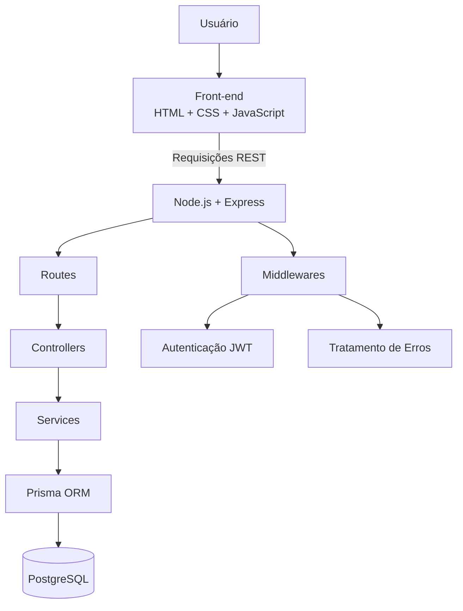
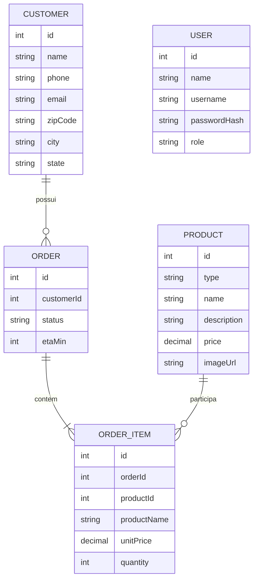
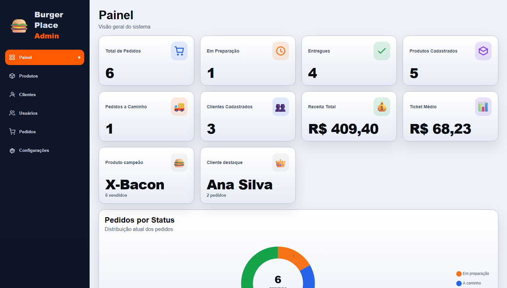
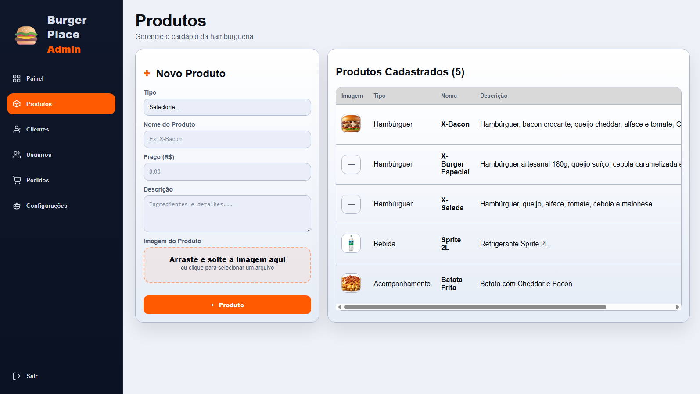
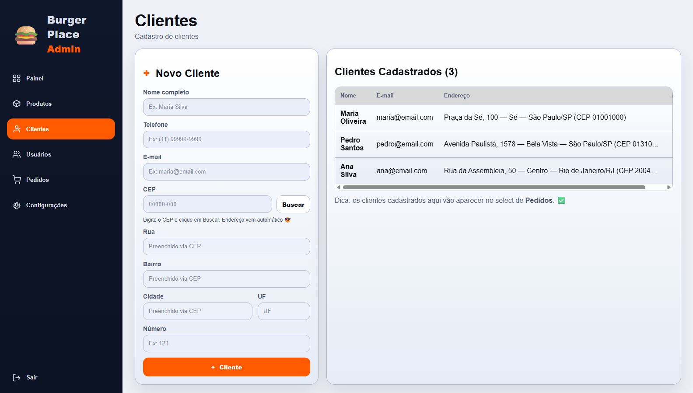
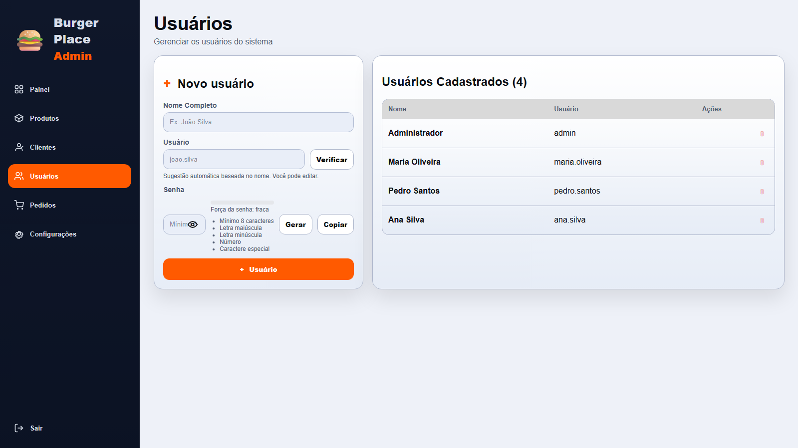
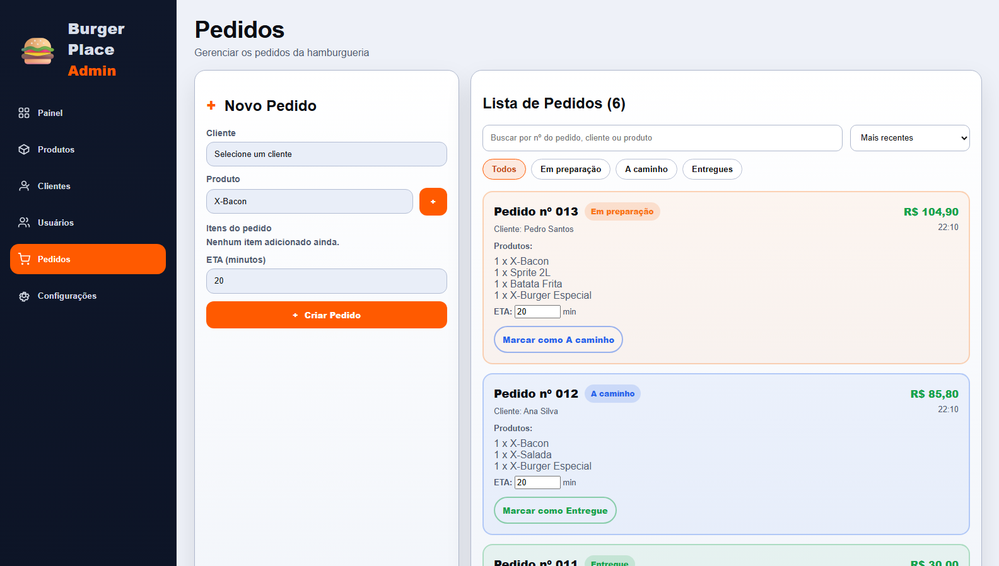
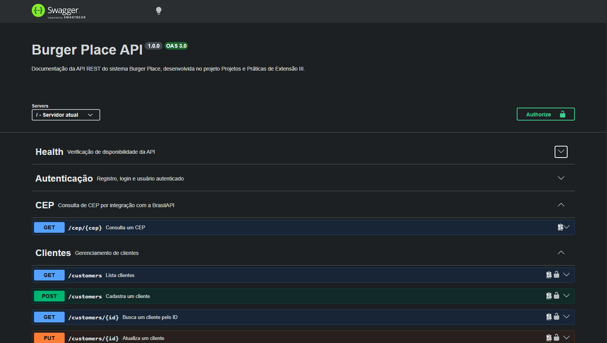
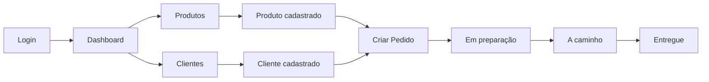

# Documentação Técnica - Burger Place

## 1. Introdução

O Burger Place é uma aplicação web Full Stack desenvolvida para apoiar o gerenciamento administrativo de uma hamburgueria.

O sistema permite administrar produtos, clientes, pedidos, usuários e indicadores de desempenho por meio de uma arquitetura cliente-servidor composta por Front-end, API REST, regras de negócio e banco de dados PostgreSQL.

Esta documentação apresenta as principais funcionalidades, fluxos de utilização, arquitetura, modelo de dados, API, testes e orientações para solução de problemas.

---

## 2. Visão Geral do Sistema

O Burger Place possui os seguintes recursos principais:

- autenticação de usuários;
- gerenciamento de produtos;
- gerenciamento de clientes;
- criação e acompanhamento de pedidos;
- consulta automática de CEP;
- dashboard administrativo;
- indicadores de desempenho;
- autenticação por JWT;
- persistência em PostgreSQL;
- documentação interativa da API com Swagger/OpenAPI;
- testes automatizados de Back-end;
- testes de comportamento do Front-end;
- Integração Contínua com GitHub Actions.

---

## 3. Manual do Usuário

### 3.1 Acesso ao sistema

Para acessar o sistema:

1. Inicie o Back-end.
2. Inicie o Front-end.
3. Acesse a aplicação pelo navegador.
4. Informe usuário e senha na tela de login.
5. Clique em **Entrar**.

Após a autenticação, o usuário é direcionado ao painel administrativo.

### 3.2 Dashboard

O Dashboard apresenta uma visão geral dos dados da hamburgueria.

Entre os indicadores disponíveis estão:

- total de produtos;
- total de clientes;
- total de pedidos;
- pedidos em preparação;
- pedidos a caminho;
- pedidos entregues;
- receita total;
- ticket médio;
- produto mais vendido;
- cliente destaque;
- produtos mais vendidos;
- atividades recentes.

Os dados são obtidos diretamente da API e calculados a partir das informações persistidas no PostgreSQL.

### 3.3 Gerenciamento de Produtos

O módulo de produtos permite:

- cadastrar produtos;
- listar produtos;
- consultar um produto;
- editar produtos;
- excluir produtos;
- pesquisar produtos.

#### Cadastro de produto

Para cadastrar:

1. Acesse a área de produtos.
2. Informe o tipo.
3. Informe o nome.
4. Informe a descrição.
5. Informe o preço.
6. Adicione uma imagem, quando aplicável.
7. Confirme o cadastro.

O preço deve ser maior que zero.

Produtos vinculados a pedidos não podem ser excluídos.

### 3.4 Gerenciamento de Clientes

O módulo de clientes permite:

- cadastrar clientes;
- consultar clientes;
- atualizar dados;
- excluir clientes;
- consultar CEP automaticamente.

#### Cadastro de cliente

Para cadastrar:

1. Acesse a área de clientes.
2. Informe nome e e-mail.
3. Informe o CEP.
4. Aguarde o preenchimento automático do endereço.
5. Confirme ou complete rua, bairro, cidade e estado.
6. Informe o número do endereço.
7. Informe telefone, caso desejado.
8. Confirme o cadastro.

O CEP deve possuir oito dígitos.

Clientes com pedidos vinculados não podem ser excluídos.

### 3.5 Gerenciamento de Pedidos

O módulo de pedidos permite:

- criar pedidos;
- consultar pedidos;
- excluir pedidos;
- associar clientes;
- associar produtos;
- controlar quantidade;
- alterar status;
- alterar tempo estimado de entrega.

#### Criação de pedido

Para criar:

1. Acesse a área de pedidos.
2. Selecione um cliente.
3. Adicione um ou mais produtos.
4. Informe as quantidades.
5. Confirme o pedido.

Todo pedido deve possuir:

- um cliente existente;
- pelo menos um produto;
- quantidade maior que zero.

### 3.6 Status dos pedidos

Os status disponíveis são:

- Em preparação;
- A caminho;
- Entregue.

Quando um pedido é marcado como **Entregue**, o tempo estimado de entrega é alterado para zero.

### 3.7 Gerenciamento de Usuários

Usuários administrativos podem ser cadastrados para acessar áreas protegidas do sistema.

O cadastro exige:

- nome;
- nome de usuário;
- senha.

A senha deve possuir no mínimo seis caracteres.

As senhas não são armazenadas em texto puro. O sistema utiliza bcrypt para gerar o hash antes da persistência.

---

## 4. Fluxos de Trabalho

### 4.1 Fluxo de autenticação

```text
Usuário
   |
   v
Tela de Login
   |
   v
POST /auth/login
   |
   v
Validação das credenciais
   |
   v
bcrypt
   |
   v
JWT gerado
   |
   v
Usuário autenticado
```

### 4.2 Fluxo de cadastro de cliente

```text
Tela de Clientes
   |
   v
Informar dados
   |
   v
Consultar CEP
   |
   v
BrasilAPI
   |
   v
Preencher endereço
   |
   v
POST /customers
   |
   v
Validação
   |
   v
Prisma ORM
   |
   v
PostgreSQL
```

### 4.3 Fluxo de criação de pedido

```text
Selecionar cliente
   |
   v
Selecionar produtos
   |
   v
Informar quantidades
   |
   v
POST /orders
   |
   v
Validar cliente e produtos
   |
   v
Criar pedido e itens
   |
   v
PostgreSQL
   |
   v
Pedido disponível no sistema
```

---

## 5. Arquitetura do Sistema

O Burger Place utiliza uma arquitetura cliente-servidor organizada em camadas.

### 5.1 Diagrama de arquitetura



### 5.2 Responsabilidades

#### Front-end
Responsável pela interface e interação com o usuário.

#### Routes
Definem os endpoints disponíveis na API.

#### Controllers
Recebem as requisições HTTP e estruturam as respostas.

#### Services
Centralizam regras de negócio e validações.

#### Middlewares
Executam autenticação, tratamento de erros e validações intermediárias.

#### Prisma ORM
Realiza a comunicação entre a aplicação e o PostgreSQL.

#### PostgreSQL
Armazena os dados persistentes da aplicação.

---

## 6. Modelo de Dados

O sistema utiliza os seguintes modelos:

- User;
- Product;
- Customer;
- Order;
- OrderItem;
- Activity.

### 6.1 Diagrama do modelo de dados



---

## 7. API REST

A API é executada por padrão em:

```text
http://localhost:3333
```

A documentação interativa está disponível em:

```text
http://localhost:3333/api-docs
```

A documentação utiliza o padrão OpenAPI 3.0 e Swagger UI.

### 7.1 Autenticação

Rotas protegidas exigem:

```http
Authorization: Bearer <JWT_TOKEN>
```

O token é obtido em:

```http
POST /auth/login
```

### 7.2 Principais grupos da API

A documentação Swagger organiza os endpoints nos seguintes grupos:

- Health;
- Autenticação;
- CEP;
- Clientes;
- Dashboard;
- Pedidos;
- Produtos;
- Usuários.

Cada operação apresenta:

- descrição;
- parâmetros;
- corpo da requisição;
- exemplos;
- códigos HTTP;
- schemas;
- respostas de sucesso e erro.

---

## 8. Exemplos Práticos

### 8.1 Login

```http
POST /auth/login
Content-Type: application/json
```

```json
{
  "username": "usuario",
  "password": "senha"
}
```

Resposta:

```json
{
  "success": true,
  "data": {
    "user": {
      "id": 1,
      "name": "Administrador",
      "username": "usuario",
      "role": "admin"
    },
    "token": "<JWT_TOKEN>"
  }
}
```

### 8.2 Cadastro de produto

```http
POST /products
Authorization: Bearer <JWT_TOKEN>
Content-Type: application/json
```

```json
{
  "type": "Hambúrguer",
  "name": "X-Burger",
  "description": "Hambúrguer com carne, queijo e salada",
  "price": 24.90
}
```

### 8.3 Criação de pedido

```http
POST /orders
Authorization: Bearer <JWT_TOKEN>
Content-Type: application/json
```

```json
{
  "customerId": 1,
  "etaMin": 20,
  "items": [
    {
      "productId": 1,
      "quantity": 2
    }
  ]
}
```

---

## 9. Tratamento de Erros

A API utiliza respostas padronizadas.

```json
{
  "success": false,
  "error": {
    "code": "VALIDATION_ERROR",
    "message": "Dados inválidos."
  }
}
```

Entre os códigos utilizados estão:

- `VALIDATION_ERROR`;
- `TOKEN_MISSING`;
- `TOKEN_INVALID`;
- `INVALID_CREDENTIALS`;
- `USER_NOT_FOUND`;
- `CUSTOMER_NOT_FOUND`;
- `PRODUCT_NOT_FOUND`;
- `ORDER_NOT_FOUND`;
- `INVALID_ZIP_CODE`;
- `INVALID_STATUS`;
- `INVALID_ETA`.

---

## 10. Guia de Solução de Problemas

### API não inicia

Verifique:

- se o Node.js está instalado;
- se as dependências foram instaladas;
- se o arquivo `.env` existe;
- se `DATABASE_URL` está configurada;
- se o PostgreSQL está disponível;
- se a porta configurada está livre.

### Erro de conexão com banco

Verifique:

```env
DATABASE_URL
```

Confirme também se o PostgreSQL está em execução.

### Token ausente ou inválido

Faça login novamente e utilize o token retornado pela API.

```http
Authorization: Bearer <JWT_TOKEN>
```

### CEP não encontrado

Confirme se:

- o CEP possui oito dígitos;
- existe conexão com a internet;
- a BrasilAPI está disponível.

### Produto não pode ser excluído

Produtos utilizados em pedidos possuem vínculo com os itens dos pedidos e não podem ser excluídos.

### Cliente não pode ser excluído

Clientes com pedidos vinculados não podem ser excluídos.

### Swagger não abre

Confirme se o Back-end está rodando e acesse:

```text
http://localhost:3333/api-docs
```

---

## 11. Testes e Qualidade

O Back-end utiliza Jest, Supertest, mocks, fixtures, testes unitários e testes de integração.

O Front-end utiliza Cypress para testes de comportamento.

Última validação realizada na Atividade 4:

```text
Test Suites: 7 passed, 7 total
Tests:       19 passed, 19 total
```

### Cobertura atual

| Métrica | Cobertura |
|---|---:|
| Statements | 87.76% |
| Branches | 62.88% |
| Functions | 87.95% |
| Lines | 88.81% |

---

## 12. Integração Contínua

O projeto utiliza GitHub Actions para automatizar verificações de qualidade.

O pipeline contempla:

- instalação das dependências;
- inicialização do PostgreSQL;
- migrations;
- preparação de dados;
- testes do Back-end;
- cobertura de código;
- build do Front-end;
- testes Cypress.

---

## 13. Decisões Técnicas

As principais decisões adotadas no projeto foram:

- arquitetura em camadas para separar responsabilidades;
- Node.js e Express para implementação da API REST;
- Prisma ORM para acesso organizado aos dados;
- PostgreSQL para persistência relacional;
- JWT para autenticação stateless;
- bcrypt para proteção das senhas;
- Swagger/OpenAPI como documentação e contrato técnico da API;
- Jest e Supertest para testes do Back-end;
- Cypress para testes de comportamento do Front-end;
- GitHub Actions para Integração Contínua.

---

## 14. Screenshots

As capturas abaixo demonstram as principais funcionalidades da aplicação Burger Place.

### 14.1 Login


### 14.2 Dashboard

O painel apresenta os principais indicadores administrativos, incluindo pedidos, clientes, produtos, receita, ticket médio e desempenho operacional.



### 14.3 Produtos

A área de produtos permite cadastrar e consultar os itens disponíveis no cardápio.



### 14.4 Clientes

A área de clientes permite realizar o cadastro, consultar clientes existentes e utilizar a integração de consulta automática de CEP.



### 14.5 Usuários

A área de usuários permite cadastrar e consultar os usuários administrativos autorizados a acessar o sistema.



### 14.6 Pedidos

A área de pedidos permite criar pedidos, associar clientes e produtos e acompanhar a evolução dos status.



### 14.7 Swagger/OpenAPI

A documentação interativa da API está disponível por meio do Swagger UI e apresenta os endpoints, parâmetros, autenticação, exemplos e códigos HTTP.



---

## 15. Diagrama do Fluxo Principal



---

## 16. Considerações Finais

O Burger Place evoluiu ao longo das atividades da disciplina até atingir uma arquitetura Full Stack com persistência real, autenticação, API REST, testes automatizados, Integração Contínua e documentação interativa.

A entrega final consolida o projeto por meio da documentação técnica e da comunicação estruturada das decisões adotadas, permitindo que desenvolvedores e usuários compreendam o funcionamento do sistema com mínima assistência.
